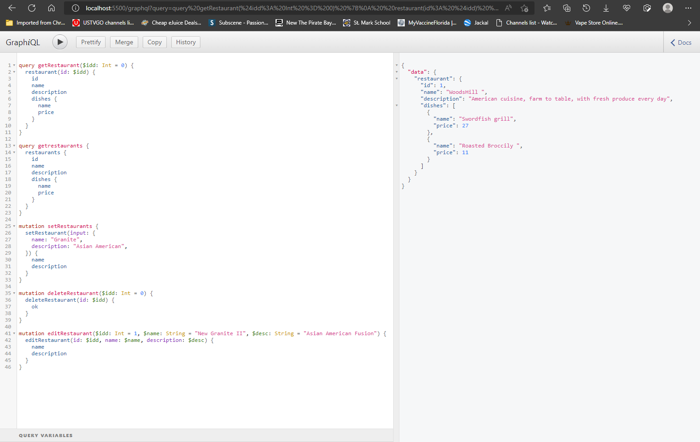
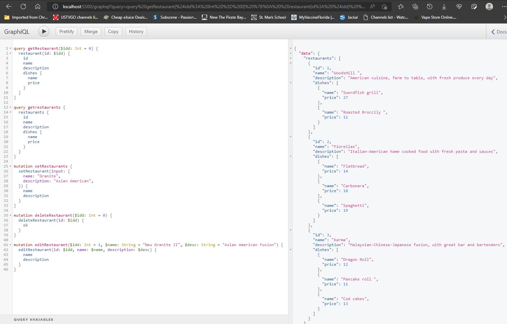
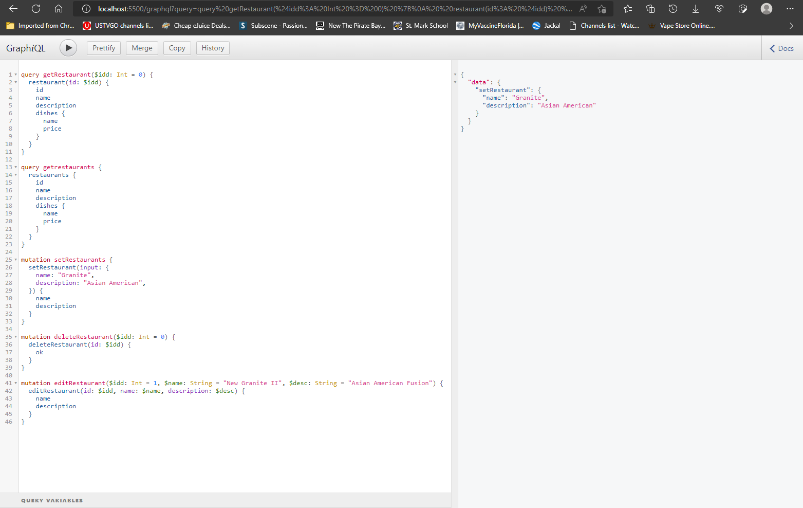

# GraphQL Restaurant Exersice

Description: Creating multi-tier applications means building multiple API endpoints to handle different data operations. The more complex your application becomes, the harder it is to maintain all these endpoints. GraphQL aims to reduce this complexity by providing a simpler view of data and making it easier to query it. 

 

 

 

 

